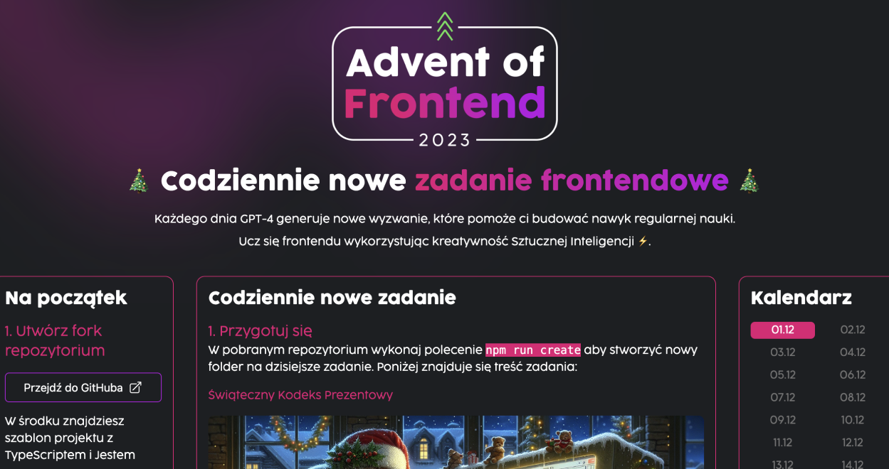

# 🎄 Advent of Frontend 2023 🎄

[👉 Przejdź do zadań](https://opanujfrontend.pl/advent)

Ucz się frontendu wykorzystując kreatywność Sztucznej Inteligencji ⚡️.

Każdego dnia GPT-4 generuje nowe wyzwanie, które pomoże ci budować nawyk regularnej nauki.

## 📝 Zadania

Zadania są dostępne na stronie [opanujfrontend.pl/advent](https://opanujfrontend.pl/advent).

Każdego dnia wykonaj w repozytorium polecenie `npm run create` a następnie skopiuj kod ze strony.

Użyj komendy `npm run create:missing`, aby utworzyć brakujące zadania od aktualnej daty do
dnia pierwszego wyzwania.

Możesz również wykonać polecenie `npm run create:month`, aby przygotować puste pliki do zadań na wszystkie 24 dni w kalendarzu.

Teraz możesz skupić się na wykonaniu zadania i weryfikacji testów poprzez polecenie `npm test`.

## 💜 Kontrybutorzy

Nasz projekt wspierają ([zobacz typ kontrybucji](https://allcontributors.org/docs/en/emoji-key)):

<!-- ALL-CONTRIBUTORS-BADGE:START - Do not remove or modify this section -->

<!-- ALL-CONTRIBUTORS-BADGE:END -->

<!-- ALL-CONTRIBUTORS-LIST:START - Do not remove or modify this section -->
<!-- prettier-ignore-start -->
<!-- markdownlint-disable -->
<table>
  <tbody>
    <tr>
      <td align="center" valign="top" width="14.28%"><a href="https://opuchalski.pl"> <b>Oskar Puchalski</b></a> <a href="https://github.com/przeprogramowani/advent-of-frontend/issues?q=author%3Amlodyoskar" title="Bug reports">🐛</a></td>
      <td align="center" valign="top" width="14.28%"><a href="https://github.com/ssynowiec"> <b>Stanisław Synowiec</b></a> <a href="https://github.com/przeprogramowani/advent-of-frontend/commits?author=ssynowiec" title="Code">💻</a> <a href="https://github.com/przeprogramowani/advent-of-frontend/issues?q=author%3Assynowiec" title="Bug reports">🐛</a></td>
      <td align="center" valign="top" width="14.28%"><a href="https://adipol.dev"> <b>Adrian Polak</b></a> <a href="#maintenance-AdiPol1359" title="Maintenance">🚧</a></td>
      <td align="center" valign="top" width="14.28%"><a href="https://marcinparda.vercel.app/"> <b>Marcin Parda</b></a> <a href="https://github.com/przeprogramowani/advent-of-frontend/commits?author=MarcinParda" title="Code">💻</a></td>
      <td align="center" valign="top" width="14.28%"><a href="https://github.com/kumiega"> <b>kumiega</b></a> <a href="https://github.com/przeprogramowani/advent-of-frontend/commits?author=kumiega" title="Code">💻</a></td>
      <td align="center" valign="top" width="14.28%"><a href="https://sdconcept.pl"> <b>Szymon Taranczewski</b></a> <a href="https://github.com/przeprogramowani/advent-of-frontend/commits?author=mystertaran" title="Code">💻</a></td>
    </tr>
  </tbody>
</table>

<!-- markdownlint-restore -->
<!-- prettier-ignore-end -->

<!-- ALL-CONTRIBUTORS-LIST:END -->

Ten projekt wykorzystuje narzędzie [all-contributors](https://github.com/all-contributors/all-contributors). Wszystkie usprawnienia i zgłoszenia bugów mile widziane 🙏!
