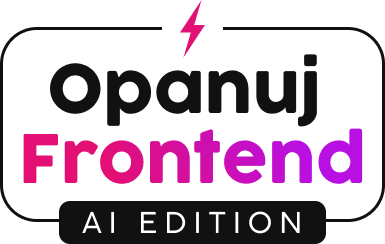

<!-- ALL-CONTRIBUTORS-BADGE:START - Do not remove or modify this section -->

<!-- ALL-CONTRIBUTORS-BADGE:END -->

# Advent of Frontend 2023

🎄 [https://opanujfrontend.pl/advent](https://opanujfrontend.pl/unstable-advent) 🎄

Ucz się frontendu wykorzystując kreatywność Sztucznej Inteligencji ⚡️.

Każdego dnia ChatGPT generuje nowe wyzwanie, które pomoże ci budować nawyk regularnej nauki.

(under development)
## Contributors ✨

Thanks goes to these wonderful people ([emoji key](https://allcontributors.org/docs/en/emoji-key)):

<!-- ALL-CONTRIBUTORS-LIST:START - Do not remove or modify this section -->
<!-- prettier-ignore-start -->
<!-- markdownlint-disable -->
<table>
  <tbody>
    <tr>
      <td align="center" valign="top" width="14.28%"><a href="https://opuchalski.pl"> <b>Oskar Puchalski</b></a> <a href="https://github.com/przeprogramowani/advent-of-frontend/issues?q=author%3Amlodyoskar" title="Bug reports">🐛</a></td>
      <td align="center" valign="top" width="14.28%"><a href="https://github.com/ssynowiec"> <b>Stanisław Synowiec</b></a> <a href="https://github.com/przeprogramowani/advent-of-frontend/commits?author=ssynowiec" title="Code">💻</a></td>
    </tr>
  </tbody>
</table>

<!-- markdownlint-restore -->
<!-- prettier-ignore-end -->

<!-- ALL-CONTRIBUTORS-LIST:END -->

Ten projekt wykorzystuje narzędzie [all-contributors](https://github.com/all-contributors/all-contributors). Wszystkie usprawnienia i zgłoszenia bugów mile widziane 🙏!
